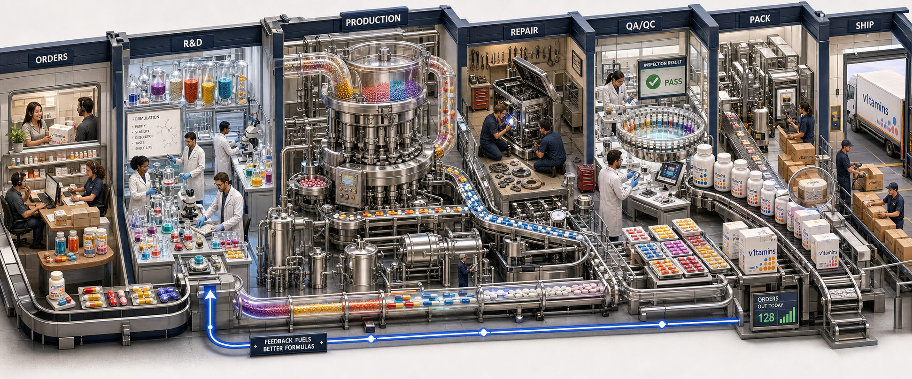
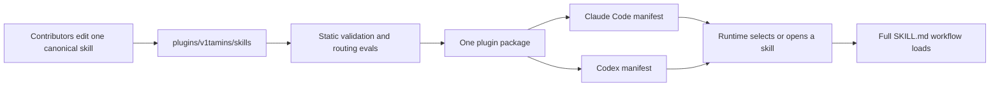

# v1tamins

```
██╗   ██╗  ██╗ ████████╗ █████╗ ███╗   ███╗██╗███╗   ██╗███████╗
██║   ██║ ███║ ╚══██╔══╝██╔══██╗████╗ ████║██║████╗  ██║██╔════╝
██║   ██║ ╚██║    ██║   ███████║██╔████╔██║██║██╔██╗ ██║███████╗
╚██╗ ██╔╝  ██║    ██║   ██╔══██║██║╚██╔╝██║██║██║╚██╗██║╚════██║
 ╚████╔╝   ██║    ██║   ██║  ██║██║ ╚═╝ ██║██║██║ ╚████║███████║
  ╚═══╝    ╚═╝    ╚═╝   ╚═╝╚═╝     ╚═╝╚═╝╚═╝  ╚═══╝╚══════╝
```

**Small, reusable skills for healthier AI-assisted development.**

v1tamins is an open-source plugin for [Claude Code](https://claude.ai/code) and
[Codex](https://openai.com/codex/). It packages 38 focused skills for planning,
debugging, reviewing, shipping, research, documentation, and product work. Use
one skill for a specific job or combine several into a repeatable workflow.

Built in the open by Version1 and Humm.

[](docs/assets/v1tamins-system-cutaway.imagegen.md)

The image treats v1tamins as a working skill pharmacy: useful formulations are
developed, tested, repaired, inspected, packaged, delivered, and improved from
feedback. The [generation record](docs/assets/v1tamins-system-cutaway.imagegen.md)
keeps the exact prompt and visual mapping for future revisions.

## Why it exists

AI coding agents often fail in familiar ways:

- A vague request becomes a large solution to the wrong problem.
- A plausible bug fix treats the symptom, not the cause.
- Working code gains extra abstractions, fallbacks, and complexity.
- Finished work stalls during review, proof, and pull-request hand-off.
- Useful lessons stay trapped in one session and get rediscovered later.

Each v1tamin addresses one bounded job. The skills stay small enough to choose
deliberately and useful enough to compose.

> [!TIP]
> If you do not know which skill to use, invoke `/v1-menu` in Claude Code or
> `$v1-menu` in Codex. It is the explicit index for the complete collection.

## Install

v1tamins ships as one plugin package for both runtimes. The installed skill
names use the `v1-` prefix, such as `v1-debug` and `v1-deep-review`, to avoid
collisions with other skills. Invoke a skill as `/v1-debug` in Claude Code or
`$v1-debug` in Codex.

### Claude Code

Run these commands inside Claude Code:

```text
/plugin marketplace add v1-io/v1tamins
/plugin install v1tamins@v1tamins
```

For local plugin development, replace `v1-io/v1tamins` with the path to your
checkout.

### Codex

Add the marketplace from a terminal:

```bash
codex plugin marketplace add v1-io/v1tamins
```

Then install or enable `v1tamins` in the Codex plugin UI. For local plugin
development, replace `v1-io/v1tamins` with the path to your checkout.

### Try it

Name a skill directly when you want a specific workflow.

In Claude Code:

```text
/v1-debug trace why this test fails only in CI
/v1-deep-review review this branch for merge risk and maintainability
/v1-pr-description refresh this pull request title and body
/v1-menu help me choose a skill
```

In Codex:

```text
$v1-debug trace why this test fails only in CI
$v1-deep-review review this branch for merge risk and maintainability
$v1-pr-description refresh this pull request title and body
$v1-menu help me choose a skill
```

You can also describe the job in plain language. Skills marked for implicit use
can be selected by the runtime from their compact metadata. High-impact and
deliberate workflows stay explicit or stop at a separate action gate.

## How it works

The repository is a configuration distribution project, not an application.
What it ships is skill guidance, routing metadata, helper assets, and plugin
manifests.



The important parts are:

1. **One canonical skill source.** Every distributed skill lives under
   `plugins/v1tamins/skills/v1-<name>/`. Claude Code and Codex do not maintain
   separate copies.
2. **Compact routing metadata.** A runtime often chooses a skill before it
   loads the full `SKILL.md`. The skill description therefore states the core
   purpose and natural trigger phrases, while methods and edge cases stay in
   the body or references.
3. **An explicit invocation posture.** Each skill declares `implicit`,
   `selective_implicit`, or `explicit_only` in `agents/openai.yaml`.
4. **Reviewable routing evidence.** The trigger inventory and JSONL routing
   fixture record when each skill should trigger, should not trigger, or needs
   an action gate.
5. **Static delivery checks.** The validator checks manifests, metadata,
   routing coverage, links inside skills, version parity, and distribution
   boundaries before a change ships.

## Find the right skill

These common entry points cover much of the day-to-day work:

| You need to… | Start with |
| --- | --- |
| Turn a fuzzy request into clear requirements | [`/v1-interview-me`](plugins/v1tamins/skills/v1-interview-me/SKILL.md) |
| Cut an oversized plan to the smallest useful scope | [`/v1-bare-bones`](plugins/v1tamins/skills/v1-bare-bones/SKILL.md) |
| Debug an observable failure to a tested cause | [`/v1-debug`](plugins/v1tamins/skills/v1-debug/SKILL.md) |
| Repair a failing test suite | [`/v1-fix-tests`](plugins/v1tamins/skills/v1-fix-tests/SKILL.md) |
| Improve working but rough code | [`/v1-refine`](plugins/v1tamins/skills/v1-refine/SKILL.md) |
| Review a branch or PR before merge | [`/v1-deep-review`](plugins/v1tamins/skills/v1-deep-review/SKILL.md) |
| Prepare a pull request | [`/v1-pr`](plugins/v1tamins/skills/v1-pr/SKILL.md) |
| Explain a pull request visually | [`/v1-pr-walkthrough`](plugins/v1tamins/skills/v1-pr-walkthrough/SKILL.md) |
| Research a complex question | [`/v1-deep-research`](plugins/v1tamins/skills/v1-deep-research/SKILL.md) |
| Create or audit an Agent Skill | [`/v1-skilling-it`](plugins/v1tamins/skills/v1-skilling-it/SKILL.md) |

### Workflows that compose

| Journey | Suggested chain |
| --- | --- |
| Idea to reviewed plan | `/v1-interview-me` → `/v1-strategy-review` → `/v1-bare-bones` → `/v1-prd` |
| Bug to verified fix | `/v1-debug` → `/v1-write-tests` → `/v1-refine` → `/v1-deep-review` |
| Planned unit to mergeable PR | `/v1-implement-unit` (includes review and landing phases) |
| PR review hand-off | `/v1-deep-review` → `/v1-address-review` → `/v1-land-pr` |
| Learning loop | `/v1-goldpan` → `/ce-compound` → `/v1-docs-freshness` → `/v1-changelog` |

These are useful paths, not a required framework. Start with the smallest skill
that matches the job.

## Complete skill catalog

<details>
<summary><strong>Plan and align</strong></summary>

| Skill | Use it when |
| --- | --- |
| [`/v1-interview-me`](plugins/v1tamins/skills/v1-interview-me/SKILL.md) | An idea, ticket, or feature request needs structured questions before implementation. |
| [`/v1-strategy-review`](plugins/v1tamins/skills/v1-strategy-review/SKILL.md) | A plan, PRD, or direction needs a strategic challenge. |
| [`/v1-bare-bones`](plugins/v1tamins/skills/v1-bare-bones/SKILL.md) | A plan needs the smallest useful scope. |
| [`/v1-shared-language`](plugins/v1tamins/skills/v1-shared-language/SKILL.md) | A team or codebase needs one clear domain vocabulary. |
| [`/v1-prd`](plugins/v1tamins/skills/v1-prd/SKILL.md) | A feature request needs a product requirements document. |
| [`/v1-learning-from-customers`](plugins/v1tamins/skills/v1-learning-from-customers/SKILL.md) | Customer discovery needs planning, audit, or synthesis. |
| [`/v1-testing-prototypes`](plugins/v1tamins/skills/v1-testing-prototypes/SKILL.md) | Prototype sessions need a test plan or evidence synthesis. |
| [`/v1-reviewing-usability`](plugins/v1tamins/skills/v1-reviewing-usability/SKILL.md) | A UI or flow needs a usability review. |

</details>

<details>
<summary><strong>Build and debug</strong></summary>

| Skill | Use it when |
| --- | --- |
| [`/v1-implement-unit`](plugins/v1tamins/skills/v1-implement-unit/SKILL.md) | One adequately planned unit needs implementation, review, and PR hand-off. |
| [`/v1-debug`](plugins/v1tamins/skills/v1-debug/SKILL.md) | An observable problem needs a tested causal explanation. |
| [`/v1-fix-tests`](plugins/v1tamins/skills/v1-fix-tests/SKILL.md) | A failing test suite needs systematic repair. |
| [`/v1-write-tests`](plugins/v1tamins/skills/v1-write-tests/SKILL.md) | New or changed behavior needs focused unit tests. |
| [`/v1-e2e-testing`](plugins/v1tamins/skills/v1-e2e-testing/SKILL.md) | Browser end-to-end tests need implementation or debugging. |

</details>

<details>
<summary><strong>Review and improve</strong></summary>

| Skill | Use it when |
| --- | --- |
| [`/v1-refine`](plugins/v1tamins/skills/v1-refine/SKILL.md) | Working code needs a quality pass, deslop, or hindsight rewrite. |
| [`/v1-deep-review`](plugins/v1tamins/skills/v1-deep-review/SKILL.md) | A PR or branch needs review for merge risk and maintainability. |
| [`/v1-review-board`](plugins/v1tamins/skills/v1-review-board/SKILL.md) | A PR needs a parallel, read-only multi-agent review and one finding ledger. |
| [`/v1-reviewing-data-graphics`](plugins/v1tamins/skills/v1-reviewing-data-graphics/SKILL.md) | Charts, dashboards, or metrics need an integrity and clarity review. |
| [`/v1-diagnosing-constraints`](plugins/v1tamins/skills/v1-diagnosing-constraints/SKILL.md) | A queue, process, or team needs its throughput constraint identified. |
| [`/v1-designing-habit-systems`](plugins/v1tamins/skills/v1-designing-habit-systems/SKILL.md) | A habit, routine, or cadence needs design or diagnosis. |

</details>

<details>
<summary><strong>Ship</strong></summary>

| Skill | Use it when |
| --- | --- |
| [`/v1-pr`](plugins/v1tamins/skills/v1-pr/SKILL.md) | Local work needs a draft pull request. |
| [`/v1-pr-description`](plugins/v1tamins/skills/v1-pr-description/SKILL.md) | A PR title and body need generation or refresh. |
| [`/v1-land-pr`](plugins/v1tamins/skills/v1-land-pr/SKILL.md) | A completed branch needs commit, push, CI follow-through, and review hand-off. |
| [`/v1-pr-walkthrough`](plugins/v1tamins/skills/v1-pr-walkthrough/SKILL.md) | A PR needs a self-contained interactive explanation. |
| [`/v1-address-review`](plugins/v1tamins/skills/v1-address-review/SKILL.md) | Existing PR review threads need resolution. |
| [`/v1-prove-work`](plugins/v1tamins/skills/v1-prove-work/SKILL.md) | Browser behavior needs a GIF as review evidence. |

</details>

<details>
<summary><strong>Research, communicate, and compound</strong></summary>

| Skill | Use it when |
| --- | --- |
| [`/v1-deep-research`](plugins/v1tamins/skills/v1-deep-research/SKILL.md) | A complex question needs iterative multi-source research. |
| [`/v1-autoresearch-skill`](plugins/v1tamins/skills/v1-autoresearch-skill/SKILL.md) | A measurable target needs an autonomous optimization loop. |
| [`/v1-canon2skill`](plugins/v1tamins/skills/v1-canon2skill/SKILL.md) | Source material needs reusable skill ideas. |
| [`/v1-stickify`](plugins/v1tamins/skills/v1-stickify/SKILL.md) | Communication needs to be clearer and more memorable. |
| [`/v1-md2docs`](plugins/v1tamins/skills/v1-md2docs/SKILL.md) | Markdown needs publishing as a formatted Google Doc. |
| [`/v1-html-it`](plugins/v1tamins/skills/v1-html-it/SKILL.md) | A review, report, prototype, or explainer needs a self-contained HTML artifact. |
| [`/v1-goldpan`](plugins/v1tamins/skills/v1-goldpan/SKILL.md) | Recent work needs scanning for lessons worth documenting. |
| [`/v1-docs-freshness`](plugins/v1tamins/skills/v1-docs-freshness/SKILL.md) | Existing documentation needs synchronization with shipped behavior. |
| [`/v1-changelog`](plugins/v1tamins/skills/v1-changelog/SKILL.md) | Merged PRs need release notes. |

</details>

<details>
<summary><strong>Skills for skills and agents</strong></summary>

| Skill | Use it when |
| --- | --- |
| [`/v1-menu`](plugins/v1tamins/skills/v1-menu/SKILL.md) | You need the explicit index and help choosing a skill. |
| [`/v1-phone-a-friend`](plugins/v1tamins/skills/v1-phone-a-friend/SKILL.md) | Work needs an independent model or runtime opinion. |
| [`/v1-skilling-it`](plugins/v1tamins/skills/v1-skilling-it/SKILL.md) | An Agent Skill needs creation, editing, audit, validation, or a Canonical Source decision. |
| [`/v1-prompt-engineering`](plugins/v1tamins/skills/v1-prompt-engineering/SKILL.md) | A prompt, system prompt, hook, or sub-agent brief needs improvement. |

</details>

## Routing and safety boundaries

Every skill declares one invocation posture:

| Posture | Meaning |
| --- | --- |
| `implicit` | The runtime may select and invoke it for ordinary local work. |
| `selective_implicit` | The runtime may select it, but costly or high-impact actions remain separately gated. |
| `explicit_only` | A human or named automation must invoke it directly. |

There is no supported `agent-only` posture. Parent workflows such as
`/v1-implement-unit`, `/v1-review-board`, `/v1-pr`, and `/v1-land-pr` stay
explicit even when their child skills are available for implicit use.

Some skills can push Git changes, publish documents, launch peer agents, record
browser proof, or update external systems. Their metadata records those side
effects, but metadata does not replace user approval or host permissions. Read
the selected skill before allowing a consequential action.

> [!WARNING]
> `/v1-land-pr` can mark a pull request ready for review and move a linked
> Linear ticket to Human Review. Invoke it only when the work is complete and
> those hand-off actions are intended.

Live routing evals are optional because they can call a locally authenticated
runtime and create ignored transcripts under `.v1tamins/live-routing/`. Missing
runtime access is inconclusive, not a static validation failure. Do not commit
raw transcripts.

## Recommended companion: compound-engineering

Some workflows can compose with [Every's compound-engineering
plugin](https://github.com/EveryInc/compound-engineering-plugin):

- `/v1-goldpan` depends on its session readers and `/ce-compound` writer.
- `/v1-implement-unit` uses `/ce-work` when available and has a local fallback
  when it is not.
- `/v1-pr` can use a compound-engineering review workflow when the user asks
  for that extra pass.

Install it alongside v1tamins if you want those integrations:

```text
# Claude Code
/plugin marketplace add EveryInc/compound-engineering-plugin
/plugin install compound-engineering@compound-engineering-plugin

# Codex
codex plugin marketplace add EveryInc/compound-engineering-plugin
# then install compound-engineering in the Codex plugin UI
```

## Repository map

```text
v1tamins/
├── .agents/plugins/                 # Codex marketplace manifest
├── .claude-plugin/                  # Claude Code marketplace manifest
├── plugins/v1tamins/                # Shared plugin package
│   ├── .claude-plugin/              # Claude Code plugin manifest
│   ├── .codex-plugin/               # Codex plugin manifest
│   ├── evals/                       # Routing contracts and behavior fixtures
│   └── skills/v1-*/                 # Canonical distributed skill sources
├── scripts/                         # Static validators and optional eval tools
├── CONTEXT.md                       # Repository vocabulary
└── AGENTS.md                        # Contribution and agent rules
```

The old tracked `.agents/skills/<name>/` mirror is no longer part of the
distribution. Direct-checkout consumers should use
`plugins/v1tamins/skills/v1-<name>/`. Existing plugin consumers already using
`/v1-*` names do not need a migration.

## Contributing

This is a public repository. Keep every contribution reusable and public-safe:
do not commit secrets, private customer or project names, internal links,
account identifiers, proprietary timelines, or absolute local paths.

For a new or changed skill:

1. Check [`.out-of-scope/`](.out-of-scope/) for a prior decision.
2. Edit the Canonical Source under `plugins/v1tamins/skills/v1-<name>/`.
3. Keep the `SKILL.md` `name` aligned with its directory and add the required
   `agents/openai.yaml` metadata. Keep the frontmatter description focused on
   the core purpose and distinct natural triggers; target 180 characters or
   fewer.
4. Update the [trigger inventory](plugins/v1tamins/evals/trigger-inventory.md),
   [routing fixture](plugins/v1tamins/evals/skill-routing.jsonl), and
   [`v1-menu`](plugins/v1tamins/skills/v1-menu/SKILL.md) when routing or the
   catalog changes.
5. Add a changeset with `npx changeset` for distributed skill changes. Do not
   hand-edit package or manifest versions.
6. Run the validator and test the skill in a real project.
7. Run a privacy and portability scan over the changed files.
8. Open a pull request.

The full authoring workflow is in
[`/v1-skilling-it`](plugins/v1tamins/skills/v1-skilling-it/SKILL.md). GitHub
Issues are the public [issue tracker](docs/agents/issue-tracker.md).

## Validation

Install development dependencies once:

```bash
npm ci --no-audit --no-fund
```

Run the repository-native static check:

```bash
scripts/validate-plugin.sh --verbose
```

It validates both marketplace manifests, both plugin manifests, skill
frontmatter, required Codex metadata, routing coverage, local skill links,
portable helper paths, three-way version parity, and the absence of the old
tracked skill mirror.

For routing-sensitive changes, an optional bounded live smoke check is
available:

```bash
scripts/run-skill-routing-live-eval.py --runtime codex --max-cases 3
```

See the [routing eval guide](plugins/v1tamins/evals/README.md) for evidence
classes, Claude Code examples, and behavior-eval commands.

To compare an installed plugin with this Canonical Source without changing
caches or credentials, run:

```bash
scripts/verify-installed-plugin.sh \
  --canonical <canonical-plugin-root> \
  --installed <installed-plugin-root> \
  --runtime codex
```

The result reports `match`, `stale`, `missing`, or `ambiguous`. Repeat with
`--runtime claude` for a Claude Code installation.

`scripts/sync-skill-hosts.sh` is a legacy compatibility wrapper. New
documentation and automation should call `scripts/validate-plugin.sh`.

## Releases and generated artifacts

Changesets own version updates. When a release change reaches `main`, the
release workflow opens or updates a **Version Packages** PR. That generated PR
updates `package.json` and `CHANGELOG.md`, then keeps the Claude Code and Codex
plugin manifest versions in lockstep. The package is private to npm tooling;
the workflow does not publish it to a package registry.

Generated evidence from live routing and behavior evals stays under ignored
`.v1tamins/` directories. Share a summary or selected normalized result in a
PR, not raw transcripts.

Generated README images have an adjacent `.imagegen.md` record. Update the
image, its README use, and the generation record together.

## Requirements

- [Claude Code](https://claude.ai/code) and/or [Codex](https://openai.com/codex/)
- Node.js and npm for changesets and CI parity
- Ruby for YAML and skill-frontmatter validation; no gems are required
- Python 3 for routing fixtures and helper checks
- `jq` for JSON manifest validation

## License

[MIT](LICENSE) © 2026 v1tamins contributors.
