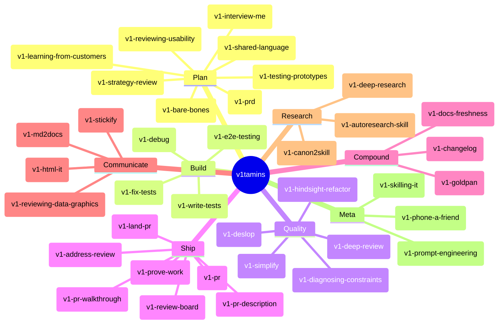
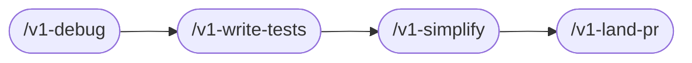
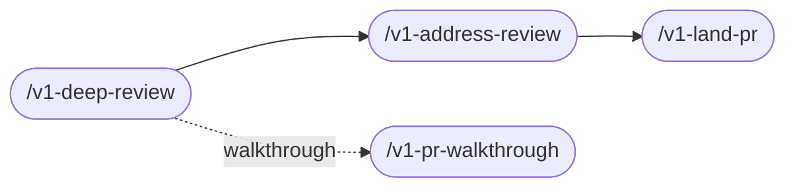
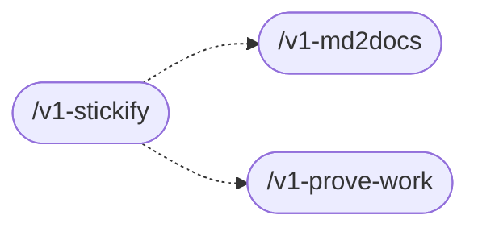

# v1tamins

```
██╗   ██╗  ██╗ ████████╗ █████╗ ███╗   ███╗██╗███╗   ██╗███████╗
██║   ██║ ███║ ╚══██╔══╝██╔══██╗████╗ ████║██║████╗  ██║██╔════╝
██║   ██║ ╚██║    ██║   ███████║██╔████╔██║██║██╔██╗ ██║███████╗
╚██╗ ██╔╝  ██║    ██║   ██╔══██║██║╚██╔╝██║██║██║╚██╗██║╚════██║
 ╚████╔╝   ██║    ██║   ██║  ██║██║ ╚═╝ ██║██║██║ ╚████║███████║
  ╚═══╝    ╚═╝    ╚═╝   ╚═╝  ╚═╝╚═╝     ╚═╝╚═╝╚═╝  ╚═══╝╚══════╝
```

**AI coding agents fail in five predictable ways. v1tamins is one sharp skill for each.**

Daily supplements for healthy code, from the Version1 team. Plugin install for Claude Code and Codex. Skills compose into the workflows you actually use — idea → ship, bug → fix, weekly compounding. Mix and match.

## Install

v1tamins ships as a plugin for Claude Code and Codex. One shared `skills/` directory under `plugins/v1tamins/` serves both runtimes through sibling per-runtime manifests. Plugin-distributed skills carry a `v1-` prefix (`v1-pr`, `v1-debug`, `v1-goldpan`) to avoid colliding with other public or personal skills.

**Claude Code**

```text
/plugin marketplace add v1-io/v1tamins
/plugin install v1tamins@v1tamins
```

For local development against a checkout, point the marketplace at the path:

```text
/plugin marketplace add ~/v1tamins
```

**Codex**

```bash
codex plugin marketplace add v1-io/v1tamins
```

Then install or enable the `v1tamins` plugin from Codex's plugin UI. For local development use `~/v1tamins` in place of `v1-io/v1tamins`.

Updates flow through the runtime's marketplace refresh — there's nothing to rerun.

## Autonomous use

v1tamins is designed for explicit invocation and autonomous routing. Codex and
Claude Code decide whether to load a skill from compact metadata before they
read the full `SKILL.md`, and both runtimes can shorten skill descriptions when
many skills are installed. Treat the skill name and first description clause as
the routing contract.

The package keeps that contract reviewable with:

- `plugins/v1tamins/evals/trigger-inventory.md` — the trigger, near-miss,
  side-effect, and budget-risk inventory for every distributed skill.
- `plugins/v1tamins/evals/skill-routing.jsonl` — realistic should-trigger,
  should-not-trigger, overlap, side-effect, and budget-stress prompts.
- `scripts/check-skill-routing-fixture.py` — fixture coverage validation, wired
  into `scripts/validate-plugin.sh`.
- `scripts/run-skill-routing-live-eval.py` and
  `scripts/score-skill-routing-live-eval.py` — optional live smoke checks that
  sample real Codex or Claude Code routing and write ignored local artifacts
  under `.v1tamins/live-routing/`.

When changing a skill name, description, `agents/openai.yaml`, invocation
policy, or routing-relevant body guidance, update the trigger inventory and
routing fixture in the same change. Low-risk local review/edit skills should be
easy for agents to invoke implicitly. Skills that push, publish, upload, create
external docs, move issues, or launch broad peer workflows should be explicit or
gated. Deliberate rituals the user always summons by name — session mining,
long autonomous loops — should also be `explicit_only`
(`disable-model-invocation: true` plus
`policy.allow_implicit_invocation: false`): their descriptions spend routing
budget without earning autonomous reach. Before converting, check the live
evals for natural-phrase traffic: if users reach the skill by describing the
task rather than naming it, hiding it misroutes that traffic to neighbors
instead of saving budget.

`/v1-menu` is the index over the full skill set — the one name to remember
when you can't recall which skill fits, and where `explicit_only` skills stay
discoverable. It stays model-reachable (`selective_implicit`) so a plain
"which skill should I use?" routes to it. When a skill is added, renamed,
removed, or changes posture, update `v1-menu` in the same change;
`scripts/validate-plugin.sh` fails on menu drift.

Live evals are opt-in because they may require local runtime authentication and
model calls. Use them after changing high-overlap descriptions, invocation
posture, or side-effect policy; treat missing runtime/auth as inconclusive
rather than a static validation failure. Do not commit raw live transcripts.

### Recommended companion: compound-engineering

A few v1tamins skills compose directly with [Every's compound-engineering plugin](https://github.com/EveryInc/compound-engineering-plugin):

- `/v1-goldpan` queues approved candidates through `/ce-compound` to write durable solution docs
- `/v1-pr` chains into `/ce-code-review` for multi-agent review before merge

Install it alongside v1tamins:

```text
# Claude Code
/plugin marketplace add EveryInc/compound-engineering-plugin
/plugin install compound-engineering@compound-engineering-plugin

# Codex
codex plugin marketplace add EveryInc/compound-engineering-plugin
# then install compound-engineering from Codex's plugin UI
```

> [!NOTE]
> v1tamins works without it — only `/v1-goldpan` will fail noisily if compound-engineering isn't installed. Everything else degrades gracefully.

## The skill universe



## Why these skills exist

You've felt all five of these:

- The 800 lines that solved a different problem.
- The bug fix that took three tries to actually fix.
- The diff full of belt-and-braces error handling for cases that can't happen.
- The PR that sat in draft for two days because writing the description felt like work.
- The teammate who rediscovers your fix six months later because nobody wrote it down.

Each v1tamin is the smallest sharp tool we could build for one of those failures. None of them try to be the whole process.

### Choose the right planning or review skill

| Need | Use | Not |
| --- | --- | --- |
| Flesh out an idea through questions | `v1-interview-me` | Customer discovery plan, prototype test, or PRD |
| Plan/audit/synthesize customer conversations | `v1-learning-from-customers` | General feature spec or prototype usability test |
| Plan or synthesize observed prototype sessions | `v1-testing-prototypes` | Customer interviews before a prototype exists |
| Review UI task completion and error risk | `v1-reviewing-usability` | Chart truthfulness or metric-dashboard integrity |
| Review charts, dashboards, or quantitative displays | `v1-reviewing-data-graphics` | General app usability review |
| Diagnose a throughput bottleneck, queue, WIP, funnel, or delivery constraint | `v1-diagnosing-constraints` | A broader expected-versus-actual failure |
| Debug any observable problem to a tested causal explanation | `v1-debug` | Open-ended ideation or explicit throughput-constraint analysis |
| Get an independent second model/runtime opinion | `v1-phone-a-friend` | First-pass in-agent review or research |
| Run a parallel multi-agent review board on a PR, then address it | `v1-review-board` | A single counterpart opinion or an in-agent review |

<details>
<summary><b>#1 &mdash; The plan is wrong before a line of code is written</b></summary>

<br>

You describe a feature. The agent writes 800 lines. About 60% solves a different problem. The rest is now your debugging tax.

> [!TIP]
> The fix isn't better prompts. It's grilling the idea, building a shared vocabulary, and writing the requirements down — before any code gets written.

- [`/v1-interview-me`](./plugins/v1tamins/skills/v1-interview-me/SKILL.md) — office-hours-style questioning that takes a fuzzy idea ("what if we did X") and walks every branch of the decision tree until you can describe what you actually want
- [`/v1-strategy-review`](./plugins/v1tamins/skills/v1-strategy-review/SKILL.md) — a CEO-style read of a plan, PRD, or proposal that pushes back on scope, ambition, and hidden assumptions ("is this big enough?")
- [`/v1-bare-bones`](./plugins/v1tamins/skills/v1-bare-bones/SKILL.md) — strip an overscoped plan down to the smallest useful version before it turns into implementation sprawl
- [`/v1-shared-language`](./plugins/v1tamins/skills/v1-shared-language/SKILL.md) — extract a DDD-style glossary from the current conversation, flag ambiguous terms, and write `LANGUAGE.md`. Pays off session after session: variables, files, and prompts all start using one vocabulary
- [`/v1-prd`](./plugins/v1tamins/skills/v1-prd/SKILL.md) — turn a Linear ticket or feature request into a real PRD
- [`/v1-learning-from-customers`](./plugins/v1tamins/skills/v1-learning-from-customers/SKILL.md) — plan, audit, and synthesize customer discovery so demand evidence comes from behavior, context, and commitments rather than compliments or hypotheticals
- [`/v1-testing-prototypes`](./plugins/v1tamins/skills/v1-testing-prototypes/SKILL.md) — plan or synthesize prototype tests that separate value, usability, and feasibility evidence before engineering commits
- [`/v1-reviewing-usability`](./plugins/v1tamins/skills/v1-reviewing-usability/SKILL.md) — review a UI, prototype, flow, form, or admin surface for discoverability, feedback, mapping, conceptual-model clarity, and user-error risk

</details>

<details>
<summary><b>#2 &mdash; Something doesn't work</b></summary>

<br>

Aligned and confident. The result is wrong. The agent's first instinct is to patch the nearest symptom and declare victory.

> [!TIP]
> Yours should be the smallest feedback loop that pins the real symptom. Tests, traces, matched cases, controlled probes, and explicit assumptions beat plausible stories.

- [`/v1-debug`](./plugins/v1tamins/skills/v1-debug/SKILL.md) — general causal debugging loop: frame the gap → build a feedback loop → audit assumptions → test hypotheses → trace cause → validate the correction. Use it for code, systems, operations, workflows, decisions, services, and everyday problems
- [`/v1-fix-tests`](./plugins/v1tamins/skills/v1-fix-tests/SKILL.md) — systematic loop that fixes failing tests until the suite is green, with feedback at every step
- [`/v1-write-tests`](./plugins/v1tamins/skills/v1-write-tests/SKILL.md) — generate unit tests for new functionality with sensible coverage and meaningful assertions
- [`/v1-e2e-testing`](./plugins/v1tamins/skills/v1-e2e-testing/SKILL.md) — Playwright-based browser tests, including a playbook for de-flaking

</details>

<details>
<summary><b>#3 &mdash; The diff is sloppy</b></summary>

<br>

Agents over-build. Extra try/except. Unused helpers. Premature abstractions. Defensive fallbacks for cases that can't happen. The code works — and the codebase gets a little harder to change.

> [!IMPORTANT]
> Ship that diff once and the next change inherits its shape. Run a quality pass *before* marking work as done.

- [`/v1-simplify`](./plugins/v1tamins/skills/v1-simplify/SKILL.md) — review or restructure the current diff or named files for reuse, simplicity, duplication, cognitive complexity, and efficiency (KISS / DRY / SOLID / YAGNI), preserving behavior
- [`/v1-deslop`](./plugins/v1tamins/skills/v1-deslop/SKILL.md) — strip AI-generated boilerplate, defensive checks, and verbose comments that add nothing
- [`/v1-hindsight-refactor`](./plugins/v1tamins/skills/v1-hindsight-refactor/SKILL.md) — when the first-pass fix is exploratory or overbuilt, delete it and reimplement a clean version using what the first pass taught you
- [`/v1-deep-review`](./plugins/v1tamins/skills/v1-deep-review/SKILL.md) — review any PR or branch (code, docs, config) on both bars: merge risk (bugs, regressions, security, tests, scope) and structural maintainability (abstraction quality, file-size boundaries, spaghetti branching); posts to GitHub only when requested

</details>

<details>
<summary><b>#4 &mdash; Shipping is the slow part</b></summary>

<br>

Code's done. Now: title, body, screenshots, push, watch CI, fix the lint failure, address the bot's three comments, fix the lint *again*, mark ready. Each step is a context switch — and the longer the diff sits, the colder it gets.

These skills compress the ship phase into one chained workflow.

- [`/v1-pr`](./plugins/v1tamins/skills/v1-pr/SKILL.md) — turn local work into a draft PR with a sensible title and body
- [`/v1-pr-description`](./plugins/v1tamins/skills/v1-pr-description/SKILL.md) — generate or refresh a PR title/body from metadata, diff, and validation evidence (use standalone or chained inside `/v1-pr`)
- [`/v1-land-pr`](./plugins/v1tamins/skills/v1-land-pr/SKILL.md) — the full hand-off: commit → push → open as draft → monitor `gh pr checks` → fix failed checks (up to 3 retries) → mark ready → move linked Linear ticket to Human Review
- [`/v1-pr-walkthrough`](./plugins/v1tamins/skills/v1-pr-walkthrough/SKILL.md) — create a throw-away HTML walkthrough that maps touched files, explains each change, and walks the PR layer by layer
- [`/v1-address-review`](./plugins/v1tamins/skills/v1-address-review/SKILL.md) — work through unresolved review threads from Copilot, Code Factory, bots, or humans and reply with the right diff or context
- [`/v1-review-board`](./plugins/v1tamins/skills/v1-review-board/SKILL.md) — convene a parallel read-only review board across several peer agents (deep-review + thermo-nuclear lenses), compile one cross-validated finding ledger, then address it — composes `/v1-phone-a-friend`, `/v1-deep-review`, and `/v1-address-review`
- [`/v1-prove-work`](./plugins/v1tamins/skills/v1-prove-work/SKILL.md) — record a browser GIF of the new behaviour to drop into the PR description

> [!WARNING]
> `/v1-land-pr` will mark a PR ready for review and move a linked Linear ticket to Human Review. Don't run it on work that isn't actually done.

</details>

<details>
<summary><b>#5 &mdash; We forget what we learned</b></summary>

<br>

The pain you can't feel in the moment: solving the same problem twice. Six months from now, a teammate hits the bug you fixed last sprint and rediscovers your solution in three days, because nobody wrote down what worked.

> [!NOTE]
> Compounding requires fresh material. `/v1-goldpan` pans for it across PRs and session logs. `/ce-compound` writes it up. Run weekly — your future self is on the team too.

- [`/v1-goldpan`](./plugins/v1tamins/skills/v1-goldpan/SKILL.md) — pan recent merged PRs and agent session logs (Claude Code + Codex + Cursor) for compound-worthy moments, present the candidates, then queue them through `/ce-compound` for documentation
- [`/v1-docs-freshness`](./plugins/v1tamins/skills/v1-docs-freshness/SKILL.md) — sync READMEs and docs with what actually shipped (post-merge, post-release, or after a new skill lands)
- [`/v1-changelog`](./plugins/v1tamins/skills/v1-changelog/SKILL.md) — generate release notes from recent merged PRs
- [`/v1-canon2skill`](./plugins/v1tamins/skills/v1-canon2skill/SKILL.md) — turn books, PDFs, articles, courses, and notes into evidence-backed recommendations for new or improved reusable skills

</details>

## Workflows that compose

Each skill does one thing. The leverage is the chain. These cycles are how Version1 actually ships — not idealised, just the paths we keep walking.

### Idea → shipped feature

```mermaid
flowchart LR
  A([/v1-interview-me]) --> B([/v1-strategy-review])
  B --> C([/v1-bare-bones])
  C --> D([/v1-learning-from-customers])
  D --> E([/v1-prd])
  E --> F{{... build ...}}
  F --> G([/v1-simplify])
  G --> H([/v1-deep-review])
  H -.explain.-> W([/v1-pr-walkthrough])
  H --> I([/v1-pr])
  I --> J([/v1-prove-work])
  J --> K([/v1-land-pr])
  K -.weekly.-> L([/v1-goldpan])
  L -.feeds back.-> A
  click A href "./plugins/v1tamins/skills/v1-interview-me/SKILL.md"
  click B href "./plugins/v1tamins/skills/v1-strategy-review/SKILL.md"
  click C href "./plugins/v1tamins/skills/v1-bare-bones/SKILL.md"
  click D href "./plugins/v1tamins/skills/v1-learning-from-customers/SKILL.md"
  click E href "./plugins/v1tamins/skills/v1-prd/SKILL.md"
  click G href "./plugins/v1tamins/skills/v1-simplify/SKILL.md"
  click H href "./plugins/v1tamins/skills/v1-deep-review/SKILL.md"
  click W href "./plugins/v1tamins/skills/v1-pr-walkthrough/SKILL.md"
  click I href "./plugins/v1tamins/skills/v1-pr/SKILL.md"
  click J href "./plugins/v1tamins/skills/v1-prove-work/SKILL.md"
  click K href "./plugins/v1tamins/skills/v1-land-pr/SKILL.md"
  click L href "./plugins/v1tamins/skills/v1-goldpan/SKILL.md"
```



### Bug investigation



### PR review hand-off



### Weekly compounding


### Communication



## Skill reference

### Plan & align

| Skill | When to use |
|-------|-------------|
| [`/v1-interview-me`](./plugins/v1tamins/skills/v1-interview-me/SKILL.md) | Fuzzy idea, ticket, or feature request needs to be fleshed out before any code is written |
| [`/v1-strategy-review`](./plugins/v1tamins/skills/v1-strategy-review/SKILL.md) | Stress-test a plan, PRD, or product direction for scope, ambition, and hidden assumptions |
| [`/v1-bare-bones`](./plugins/v1tamins/skills/v1-bare-bones/SKILL.md) | Strip an overscoped plan down to the smallest useful version |
| [`/v1-shared-language`](./plugins/v1tamins/skills/v1-shared-language/SKILL.md) | Build a DDD glossary so devs and agents stop talking past each other |
| [`/v1-prd`](./plugins/v1tamins/skills/v1-prd/SKILL.md) | Generate a PRD from a Linear ticket or feature request |
| [`/v1-learning-from-customers`](./plugins/v1tamins/skills/v1-learning-from-customers/SKILL.md) | Plan, audit, and synthesize customer discovery without false-positive demand evidence |
| [`/v1-testing-prototypes`](./plugins/v1tamins/skills/v1-testing-prototypes/SKILL.md) | Plan and synthesize prototype tests before build decisions |
| [`/v1-reviewing-usability`](./plugins/v1tamins/skills/v1-reviewing-usability/SKILL.md) | Review product interactions for discoverability, feedback, conceptual-model clarity, and user-error risk |

### Build & debug

| Skill | When to use |
|-------|-------------|
| [`/v1-debug`](./plugins/v1tamins/skills/v1-debug/SKILL.md) | General root-cause workflow for any observable problem, from code bugs to broken processes and recurring real-world failures |
| [`/v1-fix-tests`](./plugins/v1tamins/skills/v1-fix-tests/SKILL.md) | Systematic loop until the test suite is green |
| [`/v1-write-tests`](./plugins/v1tamins/skills/v1-write-tests/SKILL.md) | Generate meaningful unit tests for new code |
| [`/v1-e2e-testing`](./plugins/v1tamins/skills/v1-e2e-testing/SKILL.md) | Playwright tests, including a de-flaking playbook |

### Quality pass before merge

| Skill | When to use |
|-------|-------------|
| [`/v1-simplify`](./plugins/v1tamins/skills/v1-simplify/SKILL.md) | Review or restructure the diff or named files for reuse, simplicity, duplication, complexity, and efficiency (KISS / DRY / SOLID / YAGNI) |
| [`/v1-deslop`](./plugins/v1tamins/skills/v1-deslop/SKILL.md) | Strip AI-generated boilerplate, defensive checks, and dead comments |
| [`/v1-hindsight-refactor`](./plugins/v1tamins/skills/v1-hindsight-refactor/SKILL.md) | Throw away the messy first-pass fix and reimplement cleanly using what it taught you |
| [`/v1-deep-review`](./plugins/v1tamins/skills/v1-deep-review/SKILL.md) | Review any PR or branch (code, docs, config) for merge risk and structural maintainability; `--post` or ask to post to GitHub |
| [`/v1-diagnosing-constraints`](./plugins/v1tamins/skills/v1-diagnosing-constraints/SKILL.md) | Find the bottleneck or constraint governing throughput in a stuck process, team, queue, or roadmap |

### Ship

| Skill | When to use |
|-------|-------------|
| [`/v1-pr`](./plugins/v1tamins/skills/v1-pr/SKILL.md) | Turn local work into a draft PR |
| [`/v1-pr-description`](./plugins/v1tamins/skills/v1-pr-description/SKILL.md) | Generate or refresh a PR title and body from metadata, diff, and validation |
| [`/v1-land-pr`](./plugins/v1tamins/skills/v1-land-pr/SKILL.md) | Full hand-off: commit → push → CI → fix → mark ready → update Linear |
| [`/v1-pr-walkthrough`](./plugins/v1tamins/skills/v1-pr-walkthrough/SKILL.md) | Create a browser walkthrough that maps touched files and explains the PR in execution order |
| [`/v1-address-review`](./plugins/v1tamins/skills/v1-address-review/SKILL.md) | Resolve unresolved threads from Copilot, Code Factory, bots, or humans |
| [`/v1-prove-work`](./plugins/v1tamins/skills/v1-prove-work/SKILL.md) | Record a browser GIF for the PR description or Slack |

### Compound the learning

| Skill | When to use |
|-------|-------------|
| [`/v1-goldpan`](./plugins/v1tamins/skills/v1-goldpan/SKILL.md) | Pan recent merged PRs + agent session logs for compound-worthy moments and queue them through `/ce-compound` |
| [`/v1-docs-freshness`](./plugins/v1tamins/skills/v1-docs-freshness/SKILL.md) | Sync READMEs and docs with what actually shipped |
| [`/v1-changelog`](./plugins/v1tamins/skills/v1-changelog/SKILL.md) | Generate release notes from recent merged PRs |

### Communication

| Skill | When to use |
|-------|-------------|
| [`/v1-stickify`](./plugins/v1tamins/skills/v1-stickify/SKILL.md) | Make pitches, announcements, PR descriptions, or marketing copy memorable (Made-to-Stick framework) |
| [`/v1-md2docs`](./plugins/v1tamins/skills/v1-md2docs/SKILL.md) | Publish a Markdown doc as a fully-formatted Google Doc |
| [`/v1-html-it`](./plugins/v1tamins/skills/v1-html-it/SKILL.md) | Create polished self-contained HTML artifacts for reviews, explainers, reports, prototypes, or custom editors |
| [`/v1-reviewing-data-graphics`](./plugins/v1tamins/skills/v1-reviewing-data-graphics/SKILL.md) | Review charts, dashboards, metric tables, and quantitative visual reports for integrity and clarity |

### Research

| Skill | When to use |
|-------|-------------|
| [`/v1-deep-research`](./plugins/v1tamins/skills/v1-deep-research/SKILL.md) | Multi-source research with iterative refinement and structured synthesis. Not for simple lookups |
| [`/v1-autoresearch-skill`](./plugins/v1tamins/skills/v1-autoresearch-skill/SKILL.md) | Autonomous optimization loop — point it at any measurable target and it iterates |
| [`/v1-canon2skill`](./plugins/v1tamins/skills/v1-canon2skill/SKILL.md) | Extract reusable skill ideas from source material, including PDFs that need OCR |

### Meta — write the tools

| Skill | When to use |
|-------|-------------|
| [`/v1-phone-a-friend`](./plugins/v1tamins/skills/v1-phone-a-friend/SKILL.md) | Route work to another agent or model for counterpart review, steelmanning, delegation, or deep research |
| [`/v1-skilling-it`](./plugins/v1tamins/skills/v1-skilling-it/SKILL.md) | Create, edit, audit, or validate an Agent Skill; resolve its Canonical Source for personal, project, managed, or shared-plugin use |
| [`/v1-prompt-engineering`](./plugins/v1tamins/skills/v1-prompt-engineering/SKILL.md) | Write, improve, or migrate prompts, system prompts, hooks, or sub-agent briefs for any model or host, including GPT-5.5 / OpenAI Responses API / OpenRouter |

---

## Repo layout

```text
v1tamins/
├── .agents/plugins/         # Codex marketplace manifest
├── .claude-plugin/          # Claude Code marketplace manifest
├── plugins/v1tamins/        # Plugin package and canonical skill source
│   ├── .claude-plugin/      #   Claude Code plugin manifest
│   ├── .codex-plugin/       #   Codex plugin manifest
│   └── skills/              #   Canonical v1-* skills consumed by both runtimes
└── scripts/                 # Validation scripts
```

## Migration Note

This package uses a plugin-native source layout. The committed skill source is `plugins/v1tamins/skills/v1-<skill-name>/`; the old `.agents/skills/<skill-name>/` mirror is no longer tracked. Direct checkout consumers should update symlinks, scripts, and docs to point at the `plugins/v1tamins/skills/v1-*` paths and use the installed `v1-*` skill names.

Marketplace/plugin consumers already invoking `/v1-*` skills should not need to change anything.

## Contributing

`/v1-skilling-it` is the general workflow entry point for Agent Skills wherever
their Canonical Source belongs. The steps below are narrower: they are the
repository-specific rules for contributing a skill to the v1tamins plugin.

1. Fork and clone, add upstream:
   ```bash
   git remote add upstream git@github.com:v1-io/v1tamins.git
   ```
2. Create a branch.
3. Before proposing a new skill, check `.out-of-scope/` for a prior rejection of the concept. Edit the canonical skill at `plugins/v1tamins/skills/v1-<skill-name>/SKILL.md`. Each `SKILL.md` needs YAML frontmatter with a `v1-*` `name` matching the directory and a `description`. `allowed-tools` is recommended for skills that need tool restrictions; see [v1-skilling-it](./plugins/v1tamins/skills/v1-skilling-it/SKILL.md) for the full schema. Add required `agents/openai.yaml` Codex metadata. Include `policy.invocation_posture` and `policy.side_effects` when a skill can publish externally, push to git remotes, launch peer agents, or record browser proof. Use `invocation_posture: explicit_only` with `disable-model-invocation: true` in `SKILL.md` for deliberate rituals and for invocations that can automatically perform outward side effects. Use `selective_implicit` with `allow_implicit_invocation: true` for high-recall workflows whose outward mutations remain separately explicit and user-gated; `policy.side_effects` is still required.
4. Update `plugins/v1tamins/evals/trigger-inventory.md` and `plugins/v1tamins/evals/skill-routing.jsonl` when the change affects skill routing, invocation policy, or trigger wording. Update `v1-menu` when a skill is added, renamed, removed, or changes invocation posture.
5. Add a changeset (`npx changeset`) describing the change. CI generates the version bump and `CHANGELOG.md` and keeps `package.json` and both plugin manifests in lockstep — don't hand-edit versions.
6. Validate plugin manifests, routing evals, and skill metadata:
   ```bash
   scripts/validate-plugin.sh --verbose
   ```
7. For routing-sensitive edits, optionally run a bounded live smoke check:
   ```bash
   scripts/run-skill-routing-live-eval.py --runtime codex --max-cases 3
   ```
8. Test the skill in a real project before committing.
9. Run a privacy and portability scan over your changes — no secrets, internal URLs, customer names, or absolute local paths.
10. Open a PR.

## Validation

```bash
scripts/validate-plugin.sh           # check
scripts/validate-plugin.sh --verbose # per-file trace
```

The check validates `SKILL.md` frontmatter, required `agents/openai.yaml` metadata, routing eval coverage, trigger inventory coverage, live routing result schema JSON, metadata hygiene, local skill asset links, references to known v1tamins skills, portable helper paths, both runtime plugin manifests (`plugins/v1tamins/.claude-plugin/plugin.json` and `plugins/v1tamins/.codex-plugin/plugin.json`), both marketplace manifests (`.claude-plugin/marketplace.json` and `.agents/plugins/marketplace.json`), three-way version parity across `package.json` and both plugin manifests, and the absence of a tracked `.agents/skills` mirror. `scripts/sync-skill-hosts.sh` remains as a legacy wrapper for old local instructions; new docs should use `scripts/validate-plugin.sh`.

## Requirements

- [Claude Code](https://claude.ai/code) and/or [Codex](https://openai.com/codex/)
- Ruby (for skill frontmatter validation; no gems required)
- Python 3 (for routing fixture validation; stdlib only)
- `jq` (for JSON manifest validation in `scripts/validate-plugin.sh`)
