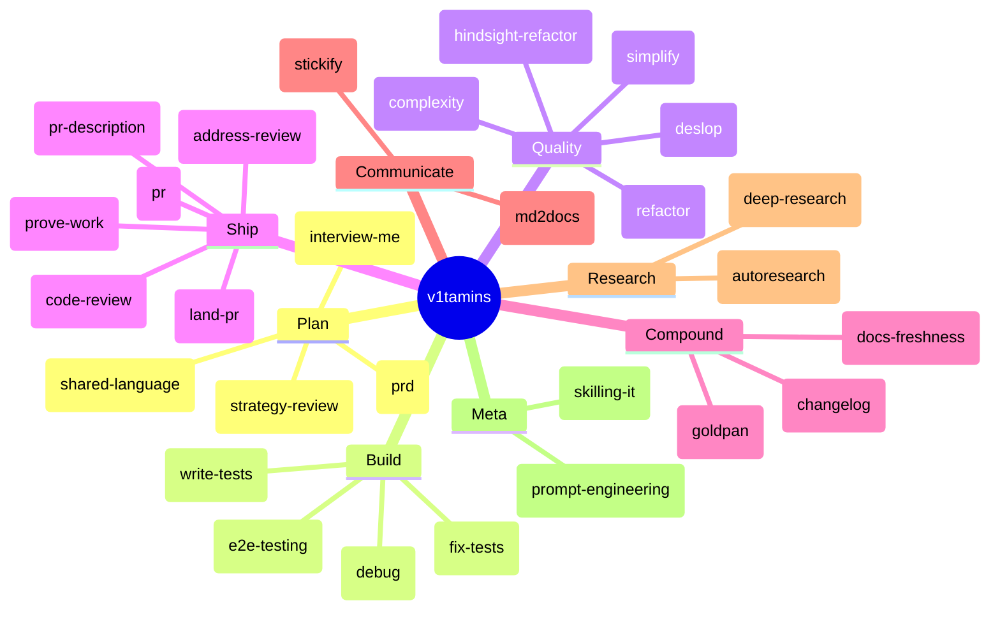
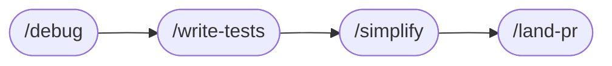
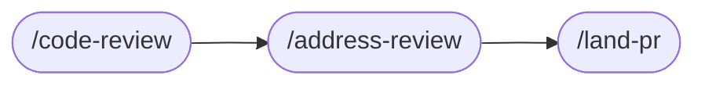
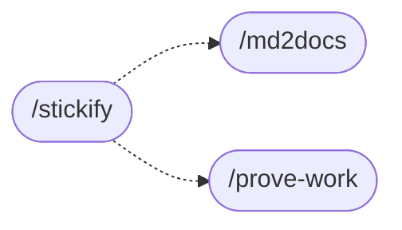

# v1tamins

```
██╗   ██╗  ██╗ ████████╗ █████╗ ███╗   ███╗██╗███╗   ██╗███████╗
██║   ██║ ███║ ╚══██╔══╝██╔══██╗████╗ ████║██║████╗  ██║██╔════╝
██║   ██║ ╚██║    ██║   ███████║██╔████╔██║██║██╔██╗ ██║███████╗
╚██╗ ██╔╝  ██║    ██║   ██╔══██║██║╚██╔╝██║██║██║╚██╗██║╚════██║
 ╚████╔╝   ██║    ██║   ██║  ██║██║ ╚═╝ ██║██║██║ ╚████║███████║
  ╚═══╝    ╚═╝    ╚═╝   ╚═╝  ╚═╝╚═╝     ╚═╝╚═╝╚═╝  ╚═══╝╚══════╝
```

**AI coding agents fail in five predictable ways. v1tamins is one sharp skill for each.**

Daily supplements for healthy code, from the Version1 team. Plugin install for Claude Code and Codex. Skills compose into the workflows you actually use — idea → ship, bug → fix, weekly compounding. Mix and match.

## The skill universe



## Why these skills exist

You've felt all five of these:

- The 800 lines that solved a different problem.
- The bug fix that took three tries to actually fix.
- The diff full of belt-and-braces error handling for cases that can't happen.
- The PR that sat in draft for two days because writing the description felt like work.
- The teammate who rediscovers your fix six months later because nobody wrote it down.

Each v1tamin is the smallest sharp tool we could build for one of those failures. None of them try to be the whole process.

<details>
<summary><b>#1 &mdash; The plan is wrong before a line of code is written</b></summary>

<br>

You describe a feature. The agent writes 800 lines. About 60% solves a different problem. The rest is now your debugging tax.

> [!TIP]
> The fix isn't better prompts. It's grilling the idea, building a shared vocabulary, and writing the requirements down — before any code gets written.

- [`/interview-me`](./.agents/skills/interview-me/SKILL.md) — office-hours-style questioning that takes a fuzzy idea ("what if we did X") and walks every branch of the decision tree until you can describe what you actually want
- [`/strategy-review`](./.agents/skills/strategy-review/SKILL.md) — a CEO-style read of a plan, PRD, or proposal that pushes back on scope, ambition, and hidden assumptions ("is this big enough?")
- [`/shared-language`](./.agents/skills/shared-language/SKILL.md) — extract a DDD-style glossary from the current conversation, flag ambiguous terms, and write `LANGUAGE.md`. Pays off session after session: variables, files, and prompts all start using one vocabulary
- [`/prd`](./.agents/skills/prd/SKILL.md) — turn a Linear ticket or feature request into a real PRD

</details>

<details>
<summary><b>#2 &mdash; The code doesn't work</b></summary>

<br>

Aligned and confident. You hit run. It crashes. The agent's first instinct is to wrap it in a try/except and declare victory.

> [!TIP]
> Yours should be a failing test that pins the symptom. Short feedback loops beat long debugging sessions — failing tests, real reproductions, instrumentation before guesses.

- [`/debug`](./.agents/skills/debug/SKILL.md) — disciplined diagnosis loop: reproduce → minimise → hypothesise → instrument → fix → regression-test. The skill to reach for first when something is broken or flaky
- [`/fix-tests`](./.agents/skills/fix-tests/SKILL.md) — systematic loop that fixes failing tests until the suite is green, with feedback at every step
- [`/write-tests`](./.agents/skills/write-tests/SKILL.md) — generate unit tests for new functionality with sensible coverage and meaningful assertions
- [`/e2e-testing`](./.agents/skills/e2e-testing/SKILL.md) — Playwright-based browser tests, including a playbook for de-flaking

</details>

<details>
<summary><b>#3 &mdash; The diff is sloppy</b></summary>

<br>

Agents over-build. Extra try/except. Unused helpers. Premature abstractions. Defensive fallbacks for cases that can't happen. The code works — and the codebase gets a little harder to change.

> [!IMPORTANT]
> Ship that diff once and the next change inherits its shape. Run a quality pass *before* marking work as done.

- [`/simplify`](./.agents/skills/simplify/SKILL.md) — review recent changes for reuse, unnecessary complexity, and efficiency before considering the work shippable
- [`/deslop`](./.agents/skills/deslop/SKILL.md) — strip AI-generated boilerplate, defensive checks, and verbose comments that add nothing
- [`/refactor`](./.agents/skills/refactor/SKILL.md) — apply KISS / DRY / SOLID / YAGNI to a working diff
- [`/complexity`](./.agents/skills/complexity/SKILL.md) — flatten nested code and reduce cognitive complexity in specific functions
- [`/hindsight-refactor`](./.agents/skills/hindsight-refactor/SKILL.md) — when the first-pass fix is exploratory or overbuilt, delete it and reimplement a clean version using what the first pass taught you

</details>

<details>
<summary><b>#4 &mdash; Shipping is the slow part</b></summary>

<br>

Code's done. Now: title, body, screenshots, push, watch CI, fix the lint failure, address the bot's three comments, fix the lint *again*, mark ready. Each step is a context switch — and the longer the diff sits, the colder it gets.

These skills compress the ship phase into one chained workflow.

- [`/pr`](./.agents/skills/pr/SKILL.md) — turn local work into a draft PR with a sensible title and body
- [`/pr-description`](./.agents/skills/pr-description/SKILL.md) — generate or refresh a PR title/body from metadata, diff, and validation evidence (use standalone or chained inside `/pr`)
- [`/land-pr`](./.agents/skills/land-pr/SKILL.md) — the full hand-off: commit → push → open as draft → monitor `gh pr checks` → fix failed checks (up to 3 retries) → mark ready → move linked Linear ticket to Human Review
- [`/code-review`](./.agents/skills/code-review/SKILL.md) — review the current branch or a specific PR with actionable, file-anchored feedback (also posts to GitHub)
- [`/address-review`](./.agents/skills/address-review/SKILL.md) — work through unresolved review threads from Copilot, Code Factory, bots, or humans and reply with the right diff or context
- [`/prove-work`](./.agents/skills/prove-work/SKILL.md) — record a browser GIF of the new behaviour to drop into the PR description

> [!WARNING]
> `/land-pr` will mark a PR ready for review and move a linked Linear ticket to Human Review. Don't run it on work that isn't actually done.

</details>

<details>
<summary><b>#5 &mdash; We forget what we learned</b></summary>

<br>

The pain you can't feel in the moment: solving the same problem twice. Six months from now, a teammate hits the bug you fixed last sprint and rediscovers your solution in three days, because nobody wrote down what worked.

> [!NOTE]
> Compounding requires fresh material. `/goldpan` pans for it across PRs and session logs. `/ce-compound` writes it up. Run weekly — your future self is on the team too.

- [`/goldpan`](./.agents/skills/goldpan/SKILL.md) — pan recent merged PRs and agent session logs (Claude Code + Codex + Cursor) for compound-worthy moments, present the candidates, then queue them through `/ce-compound` for documentation
- [`/docs-freshness`](./.agents/skills/docs-freshness/SKILL.md) — sync READMEs and docs with what actually shipped (post-merge, post-release, or after a new skill lands)
- [`/changelog`](./.agents/skills/changelog/SKILL.md) — generate release notes from recent merged PRs

</details>

## Workflows that compose

Each skill does one thing. The leverage is the chain. These cycles are how Version1 actually ships — not idealised, just the paths we keep walking.

### Idea → shipped feature

```mermaid
flowchart LR
  A([/interview-me]) --> B([/strategy-review])
  B --> C([/prd])
  C --> D{{... build ...}}
  D --> E([/simplify])
  E --> F([/code-review])
  F --> G([/pr])
  G --> H([/prove-work])
  H --> I([/land-pr])
  I -.weekly.-> J([/goldpan])
  J -.feeds back.-> A
  click A href "./.agents/skills/interview-me/SKILL.md"
  click B href "./.agents/skills/strategy-review/SKILL.md"
  click C href "./.agents/skills/prd/SKILL.md"
  click E href "./.agents/skills/simplify/SKILL.md"
  click F href "./.agents/skills/code-review/SKILL.md"
  click G href "./.agents/skills/pr/SKILL.md"
  click H href "./.agents/skills/prove-work/SKILL.md"
  click I href "./.agents/skills/land-pr/SKILL.md"
  click J href "./.agents/skills/goldpan/SKILL.md"
```



### Bug investigation



### PR review hand-off



### Weekly compounding


### Communication



## Skill reference

### Plan & align

| Skill | When to use |
|-------|-------------|
| [`/interview-me`](./.agents/skills/interview-me/SKILL.md) | Fuzzy idea, ticket, or feature request needs to be fleshed out before any code is written |
| [`/strategy-review`](./.agents/skills/strategy-review/SKILL.md) | Stress-test a plan, PRD, or product direction for scope, ambition, and hidden assumptions |
| [`/shared-language`](./.agents/skills/shared-language/SKILL.md) | Build a DDD glossary so devs and agents stop talking past each other |
| [`/prd`](./.agents/skills/prd/SKILL.md) | Generate a PRD from a Linear ticket or feature request |

### Build & debug

| Skill | When to use |
|-------|-------------|
| [`/debug`](./.agents/skills/debug/SKILL.md) | Disciplined diagnosis loop for hard bugs, flakes, and perf regressions |
| [`/fix-tests`](./.agents/skills/fix-tests/SKILL.md) | Systematic loop until the test suite is green |
| [`/write-tests`](./.agents/skills/write-tests/SKILL.md) | Generate meaningful unit tests for new code |
| [`/e2e-testing`](./.agents/skills/e2e-testing/SKILL.md) | Playwright tests, including a de-flaking playbook |

### Quality pass before merge

| Skill | When to use |
|-------|-------------|
| [`/simplify`](./.agents/skills/simplify/SKILL.md) | Review recent changes for reuse, unnecessary complexity, and efficiency before declaring done |
| [`/deslop`](./.agents/skills/deslop/SKILL.md) | Strip AI-generated boilerplate, defensive checks, and dead comments |
| [`/refactor`](./.agents/skills/refactor/SKILL.md) | Apply KISS / DRY / SOLID / YAGNI to a working diff |
| [`/complexity`](./.agents/skills/complexity/SKILL.md) | Reduce cognitive complexity in specific functions |
| [`/hindsight-refactor`](./.agents/skills/hindsight-refactor/SKILL.md) | Throw away the messy first-pass fix and reimplement cleanly using what it taught you |

### Ship

| Skill | When to use |
|-------|-------------|
| [`/pr`](./.agents/skills/pr/SKILL.md) | Turn local work into a draft PR |
| [`/pr-description`](./.agents/skills/pr-description/SKILL.md) | Generate or refresh a PR title and body from metadata, diff, and validation |
| [`/land-pr`](./.agents/skills/land-pr/SKILL.md) | Full hand-off: commit → push → CI → fix → mark ready → update Linear |
| [`/code-review`](./.agents/skills/code-review/SKILL.md) | Multi-angle review on the current branch or a specific PR, posted to GitHub |
| [`/address-review`](./.agents/skills/address-review/SKILL.md) | Resolve unresolved threads from Copilot, Code Factory, bots, or humans |
| [`/prove-work`](./.agents/skills/prove-work/SKILL.md) | Record a browser GIF for the PR description or Slack |

### Compound the learning

| Skill | When to use |
|-------|-------------|
| [`/goldpan`](./.agents/skills/goldpan/SKILL.md) | Pan recent merged PRs + agent session logs for compound-worthy moments and queue them through `/ce-compound` |
| [`/docs-freshness`](./.agents/skills/docs-freshness/SKILL.md) | Sync READMEs and docs with what actually shipped |
| [`/changelog`](./.agents/skills/changelog/SKILL.md) | Generate release notes from recent merged PRs |

### Communication

| Skill | When to use |
|-------|-------------|
| [`/stickify`](./.agents/skills/stickify/SKILL.md) | Make pitches, announcements, PR descriptions, or marketing copy memorable (Made-to-Stick framework) |
| [`/md2docs`](./.agents/skills/md2docs/SKILL.md) | Publish a Markdown doc as a fully-formatted Google Doc |

### Research

| Skill | When to use |
|-------|-------------|
| [`/deep-research`](./.agents/skills/deep-research/SKILL.md) | Multi-source research with iterative refinement and structured synthesis. Not for simple lookups |
| [`/autoresearch-skill`](./.agents/skills/autoresearch-skill/SKILL.md) | Autonomous optimization loop — point it at any measurable target and it iterates |

### Meta — write the tools

| Skill | When to use |
|-------|-------------|
| [`/skilling-it`](./.agents/skills/skilling-it/SKILL.md) | Create or improve a shared agent skill (this repo's own toolchain) |
| [`/prompt-engineering`](./.agents/skills/prompt-engineering/SKILL.md) | Write or improve prompts, system prompts, hooks, or sub-agent briefs |
| [`/prompt-engineering-v1tamins`](./.agents/skills/prompt-engineering-v1tamins/SKILL.md) | Same, specialised for GPT-5.5 / OpenAI Responses API / OpenRouter migrations |

---

## Install

v1tamins ships as a plugin for Claude Code and Codex. One shared `skills/` directory under `plugins/v1tamins/` serves both runtimes through sibling per-runtime manifests. Plugin-distributed skills carry a `v1-` prefix (`v1-pr`, `v1-debug`, `v1-goldpan`) to avoid colliding with other public or personal skills.

> [!NOTE]
> Skills prefixed with `_` in `.agents/skills/` are gitignored. Build your own private skills the same way — they'll never end up in a PR.

**Claude Code**

```text
/plugin marketplace add v1-io/v1tamins
/plugin install v1tamins@v1tamins
```

For local development against a checkout, point the marketplace at the path:

```text
/plugin marketplace add ~/v1tamins
```

**Codex**

```bash
codex plugin marketplace add v1-io/v1tamins
```

Then install or enable the `v1tamins` plugin from Codex's plugin UI. For local development use `~/v1tamins` in place of `v1-io/v1tamins`.

Updates flow through the runtime's marketplace refresh — there's nothing to rerun.

### Recommended companion: compound-engineering

A few v1tamins skills compose directly with [Every's compound-engineering plugin](https://github.com/EveryInc/compound-engineering-plugin):

- `/goldpan` queues approved candidates through `/ce-compound` to write durable solution docs
- `/pr` chains into `/ce-code-review` for multi-agent review before merge

Install it alongside v1tamins:

```text
# Claude Code
/plugin marketplace add EveryInc/compound-engineering-plugin
/plugin install compound-engineering@compound-engineering-plugin

# Codex
codex plugin marketplace add EveryInc/compound-engineering-plugin
# then install compound-engineering from Codex's plugin UI
```

> [!NOTE]
> v1tamins works without it — only `/goldpan` will fail noisily if compound-engineering isn't installed. Everything else degrades gracefully.

## Repo layout

```text
v1tamins/
├── .agents/skills/          # Canonical shared skills (source of truth)
├── .agents/plugins/         # Codex marketplace manifest
├── .claude-plugin/          # Claude Code marketplace manifest
├── plugins/v1tamins/        # Plugin package — generated v1-* mirrors of every skill
│   ├── .claude-plugin/      #   Claude Code plugin manifest
│   ├── .codex-plugin/       #   Codex plugin manifest
│   └── skills/              #   Shared skills consumed by both runtimes
└── scripts/                 # Validation + sync scripts
```

## Contributing

1. Fork and clone, add upstream:
   ```bash
   git remote add upstream git@github.com:v1-io/v1tamins.git
   ```
2. Create a branch.
3. Edit the canonical skill at `.agents/skills/<skill-name>/SKILL.md`. Each `SKILL.md` needs YAML frontmatter with `name`, `description`, and `allowed-tools`. Add an `agents/openai.yaml` when the skill should appear cleanly in Codex's skill list.
4. After creating, renaming, or changing a skill, regenerate plugin mirrors:
   ```bash
   scripts/sync-skill-hosts.sh --write
   scripts/sync-skill-hosts.sh
   ```
5. Test the skill in a real project before committing.
6. Run a privacy and portability scan over your changes — no secrets, internal URLs, customer names, or absolute local paths.
7. Open a PR.

## Validation

```bash
scripts/sync-skill-hosts.sh           # check
scripts/sync-skill-hosts.sh --write   # repair plugin mirrors
scripts/sync-skill-hosts.sh --verbose # per-file trace
```

The check validates `SKILL.md` frontmatter, optional `agents/openai.yaml` metadata, the generated `plugins/v1tamins/skills/v1-*` plugin mirrors, both runtime plugin manifests (`plugins/v1tamins/.claude-plugin/plugin.json` and `plugins/v1tamins/.codex-plugin/plugin.json`), and both marketplace manifests (`.claude-plugin/marketplace.json` and `.agents/plugins/marketplace.json`).

## Requirements

- [Claude Code](https://claude.ai/code) and/or [Codex](https://openai.com/codex/)
- Ruby (for skill frontmatter validation; no gems required)
