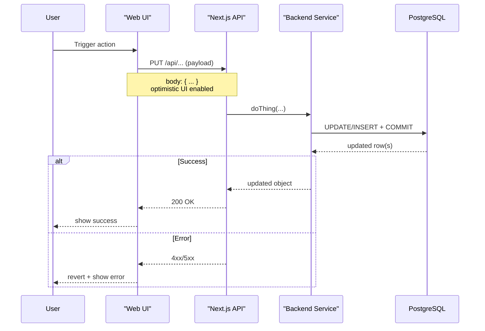

# Code Review (PR-Based, Elite/Rigorous)

## Overview

Perform a **Copilot/Greptile-style, staff-level** PR review using full repo context (not just the diff), then **post the review to GitHub**:

- **One main summary comment** on the PR (posted via GitHub CLI) that includes:
  - **Confidence Score** (with overall + file-level table)
  - **Mermaid sequence diagram** (architectural trace, if non-trivial)
- **One additional comment per file** that has actionable suggestions, each labeled **Nit / Low / Medium / Critical**.

This command is designed to be **evidence-backed**, **severity-ranked**, and aligned with Humm's architectural rules (microservices, shared libs, hierarchical APIs, logging conventions, etc.).

## Input

Provide the PR number or full GitHub PR URL:
- `/code-review 588`
- `/code-review https://github.com/v1-io/abi/pull/588`

## Prerequisites

- **GitHub CLI authenticated**: `gh auth status`
- You’re in the repo root

## Steps

### 1) Gather PR context (intent + risk)

Use GitHub CLI to pull the PR metadata and changed file list:

```bash
gh pr view <PR> --json title,body,author,baseRefName,headRefName,commits,files,labels,additions,deletions
gh pr view <PR> --comments
```

Extract and write down:
- **What** the PR claims to do (title/body/commits)
- **Where** it touches (services, shared libs, frontend)
- **Risk flags**: auth/permissions, migrations, background jobs, concurrency/async, data integrity, large refactors

### 2) Get the diff (and optionally check out)

You need both “what changed” and “how it fits”.

```bash
# Full diff (PR base → head)
gh pr diff <PR>

# File list only
gh pr diff <PR> --name-only

# Optional: checkout locally to run tests or explore code with full IDE support
gh pr checkout <PR>
```

If you checked out the PR branch locally, you can also use git for targeted diffs/history:

```bash
git status
git log --oneline --decorate -n 50
```

### 3) Build repo-aware understanding (do not review diff in isolation)

For each meaningful changed file:
- Read **surrounding code** (imports, callers, contracts, invariants).
- Search repo-wide for usage patterns / call sites:

```bash
rg "<SymbolOrFunctionName>" -n
```

Align with ABI architectural rules:
- **Backend**: router/core/shared-model patterns, required registrations/migrations.
- **Shared code**: anything reused across services belongs in `services/common/lib/`.
- **APIs**: hierarchical routes, singular naming (e.g. `/data-source/{id}/database/{id}/...`).
- **Frontend**: go through shared service clients; avoid direct fetch; preserve hierarchy/context props.

### 4) Review systematically (severity-ranked, evidence-backed)

Focus on high ROI issues (correctness, security, reliability, performance, maintainability). Avoid bikeshedding.

#### Correctness & Logic
- [ ] Boundary cases: empty/null inputs, first/last element, pagination, ordering stability
- [ ] Idempotency and retry-safety for network/job operations
- [ ] Error paths: partial failures, timeouts, exceptions (no swallowed errors)

#### Concurrency & Async
- [ ] No blocking calls in async contexts (Python/JS)
- [ ] LangChain/LangGraph: prefer `.ainvoke()` over `.invoke()` from async contexts
- [ ] Shared mutable state guarded (locks / request scoping)

#### Security & Privacy (flag hard)
- [ ] No hardcoded secrets/tokens
- [ ] Input validation present at trust boundaries
- [ ] No sensitive data/PII in logs or error payloads
- [ ] AuthN/AuthZ checks are correct (no privilege escalation)
- [ ] No injection risks (SQL must be parameterized; URLs validated to avoid SSRF)

#### Performance & Cost
- [ ] No N+1 query patterns; no queries in loops
- [ ] No unbounded queries (missing LIMIT / missing indexes for filters/joins)
- [ ] Avoid unnecessary allocations / repeated expensive calls (cache locally when needed)

#### Observability & Ops
- [ ] Logging conventions: `info` start/end only, `warning` recoverable, `error` unrecoverable with `exc_info=True`
- [ ] Errors are actionable and include enough context (without leaking secrets)

#### Database / Migrations (if applicable)
- [ ] New models registered where required (migrations + test registrations)
- [ ] `updated_at` updated on PUT/PATCH
- [ ] Migrations are safe and reversible; indexes match query patterns

#### Tests & Quality Gates
- [ ] Tests cover the “why” of the change + regressions + edge/error paths
- [ ] No flaky patterns (time, random, network without deterministic mocks)
- [ ] Lint/type checks pass (or provide explicit follow-up commands)

### 5) Produce the outputs (1 main summary + per-file comments)

## Output A: Main Summary Comment (post once)

Create **one** main summary comment in Markdown that includes:

1) **PR Summary**
- 3–6 bullets: what changed, why, user impact, and main risks

2) **Key Findings (severity-ranked)**
- **Critical / Medium / Low / Nit** items (only include what materially matters)

3) **Confidence Score** (required)
- **Overall PR confidence**: Start with `### Confidence Score: X/5` and a one-line verdict (e.g., "safe to merge", "needs extra review", "not safe to merge yet").
- **Why this score**: 2-4 bullets that call out the main reasons (scope, test coverage, backwards-compatibility, key risks/unknowns).
- **Special attention**: Either say "No files require special attention" or list the specific files/areas to double-check.
- **File-level confidence**: Add a table of important files changed with a per-file score in `X/5` form and a one-line overview.
- **Scoring guidance**: The overall score should reflect the riskiest change (not an average). Reduce score for migrations, auth/permissions, concurrency, recursion-limit changes, broad refactors, or missing tests.

4) **Sequence Diagram (Architectural Trace)** (required if non-trivial)
- If the PR introduces complex logic, inter-service flows, concurrency, caching, or non-trivial UI state, include a Mermaid sequence diagram (` ```mermaid `) in the main review comment that matches these patterns:
  - **Start**: First line must be `sequenceDiagram`. Use raw Mermaid syntax.
  - **Participants**: Declare all participants at the top. Prefer short stable IDs with readable aliases via `as` (e.g., `participant PreContext as Pre-Context Pipeline`). Use quotes for aliases with spaces/parentheses.
  - **Requests vs Responses**: Use `->>` for calls/requests and `-->>` for responses/return values.
  - **Control Flow Blocks**:
    - Use `alt` / `else` / `end` for branching (nest when needed).
    - Use `par` / `and` / `end` to show parallel execution paths.
    - Use `loop` for retries/iterations and `opt` for optional steps.
  - **Annotations**: Use `Note over X:` or `Note over X,Y:` to call out key state changes (caching, transactions, optimistic UI, side effects). Use `<br/>` inside notes for multi-line bullets.
  - **Labels**: Keep message labels short and action-oriented (function name, endpoint, DB verb). Put payload details in notes rather than long arrow text.
  - **Coverage**: Trace the full lifecycle top-to-bottom: trigger → key calls/side effects (DB/Redis/Qdrant/jobs) → response back to caller. Include the error path if it materially changes behavior.
- **Tiny template**:



### Post the main summary to GitHub

Use a PR review comment (recommended) so it’s clearly “the review”:

```bash
# Comment-only review (default)
gh pr review <PR> --comment -b "<MAIN_REVIEW_BODY>"

# If there are must-fix Critical issues, request changes instead:
gh pr review <PR> --request-changes -b "<MAIN_REVIEW_BODY>"
```

Tip: for large bodies, prefer a body file:

```bash
gh pr review <PR> --comment --body-file path/to/review.md
```

## Output B: Per-File Comments (post one comment per file with suggestions)

For each file where you have actionable suggested changes, post **one** comment (grouping that file’s issues together). Each file comment MUST:
- Start with a clear importance label: **Nit / Low / Medium / Critical**
- Include concrete fixes (what to change) and, when appropriate, a test to add

### Severity definitions
- **Critical**: likely bug/data loss/security issue, broken auth, migration risk, correctness failure
- **Medium**: reliability/perf regression risk, unclear contract, missing key tests for core behavior
- **Low**: maintainability/clarity improvements with low functional risk, minor test gaps
- **Nit**: purely cosmetic or micro-optimizations; limit these aggressively

### File comment template

```markdown
### Review: `path/to/file` (Importance: Medium)

- **Issue**: <short title>
- **Why it matters (repo-specific)**: <tie to ABI patterns/contracts>
- **Suggested change**: <what to do, minimal + safe>
- **Test**: <test to add or command to run, if applicable>
- **Cursor Prompt**: <pre-formatted cursor prompt to fix the issue, with the issue description and the suggested change>
```

### Post per-file comments to GitHub

PRs are issues too, so you can comment using `gh issue comment` with the PR URL:

```bash
gh issue comment <PR_URL> --body "<FILE_COMMENT_BODY>"
```

(Repeat once per file that has recommendations; do not post comments for files with no actionable changes.)

## Output Checklist (do not skip)

- [ ] PR context gathered (`gh pr view ...`)
- [ ] Diff reviewed (`gh pr diff ...`)
- [ ] Repo-wide usage checked for key changed contracts (`rg ...`)
- [ ] Main summary review posted (includes **Confidence Score** + **Sequence Diagram** when needed)
- [ ] Per-file comments posted for files with recommendations (with **severity labels**)
