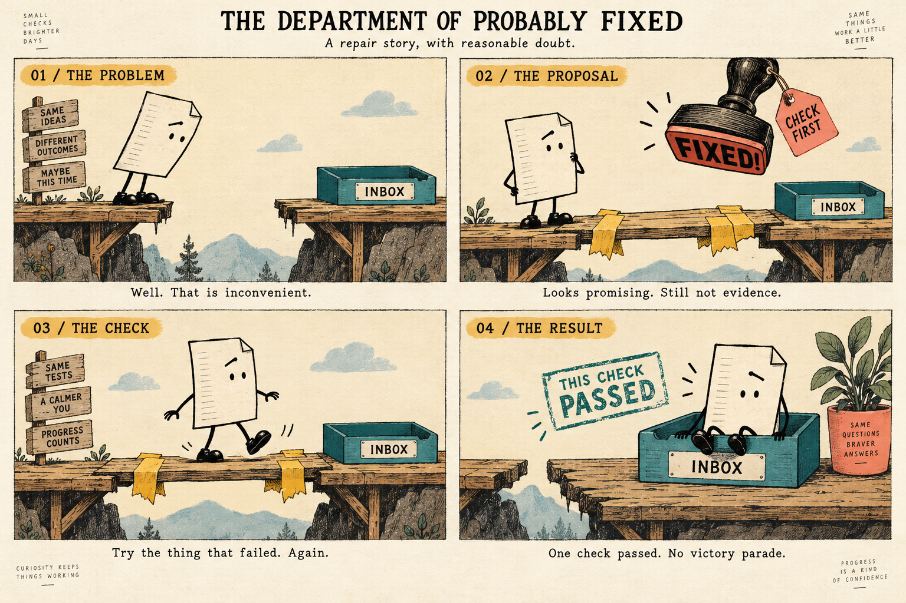

# Visual recipe: illustrated everyday system

Prefer this recipe for queues, handoffs, policies, and processes whose behavior can be shown through one concrete example. Give it the personality of a small, slightly absurd workshop: expressive everyday objects, handmade repairs, and understated humor. Honor a requested style. Use a literal interface when interaction details are the lesson, or precise geometry when quantities and mathematical relationships are the lesson. No renderer, image generator, external assets, or speech provider is required.

## Visual reference

Use this approved concept for personality, texture, and visual vocabulary, not as a finished storyboard. Simplify the scenery and omit its decorative slogans, signposts, plants, and corner copy. Keep the repaired route continuous in the final scene; the concept image's reappearing gap is not intended behavior. The title “The Department of Probably Fixed” belongs to this repair example, not to every video. See the [generation record](../assets/workshop-concept.imagegen.md).

## Appearance

- Start with warm paper, charcoal ink, and restrained mustard, teal, and coral accents. Suggested palette: paper `#FFF7E8`, ink `#393B3C`, mustard `#D8AD48`, teal `#327B7D`, coral `#CF725A`. Adjust for readable contrast; limit any one scene to the accents it needs.
- Draw recognizable objects with slightly uneven outlines, modest asymmetry, and optional subtle paper grain. Keep labels crisp. Avoid glossy 3D, heavy texture, and distressed text that interferes with reading.
- Follow one recognizable protagonist: a folded report, parcel, or other object relevant to the lesson. A raised eyebrow, tiny legs, or a hesitant posture can give it character. Preserve its silhouette, proportions, and color between scenes. Personification must not imply that a real automated system has judgment or feelings.
- Use a consistent workshop vocabulary: paper, tape, stamps, wooden ramps, or levers. Choose only props that explain an action. Do not force every topic into a bridge metaphor or add random gags.
- Use readable sans-serif labels and captions, with an optional restrained serif heading. Give one action most of the frame, leave generous empty space, and reserve caption space. Support color meanings with labels or shapes.

## Motion and voice

Give consequential actions a brief anticipation and reaction: the report peers into the gap, hesitates at the patch, then cautiously tests it. Keep stillness as the default between meaningful actions. Avoid constant bouncing, decorative camera movement, and simulated drawing hands. Preserve object identity and allow time to inspect each result.

Use warm, direct, deadpan narration. Explain the visible mechanism before adding a joke. Aim for at most one small gag or cheeky line per short explanation; the four-panel concept offers alternatives, not a requirement to use every caption. “Looks promising. Still not evidence.” reinforces the distinction between a proposal and a result. Keep captions and technical terms accurate and straightforward.

Humor should target awkward processes or premature confidence, not users, affected people, or the seriousness of harm. Reduce or omit it for sensitive subjects and formal audiences. Never let a joke remove uncertainty or imply success before a check.

## Example: proposed repair versus checked result

A skeptical little report reaches a broken route. A plank held by oversized tape appears as the proposed fix. An overenthusiastic “FIXED!” stamp approaches but visibly stops before making a mark; a “CHECK FIRST” tag makes the reason clear. Visibly return the same report to the start and repeat its journey. Only after it reaches the inbox does a modest stamp say “This check passed.” Keep the qualification that other cases remain untested. No universal “solved” banner or victory confetti.

Establish that the gap illustrates failed delivery and the bridge illustrates a proposed software change. Mark hypothetical examples as such. A real unresolved case must remain unresolved on screen. A paused or cropped frame must not accidentally show the premature stamp as an authoritative result.

## Apply and check

Before full production, render a representative frame and a short motion beat with the chosen palette, type, objects, and caption position. Check legibility, continuity, the metaphor's causal meaning, and whether the humor helps the explanation. This is a production check, not another user approval gate.

Reject a metaphor if it needs more explanation than the actual process. Avoid sprawling whiteboards, stock office characters, status-card dashboards, decorative slogans, and scenery competing with the action. Adopt the visual vocabulary using the available tools; this concept image does not require generated imagery in every video.
